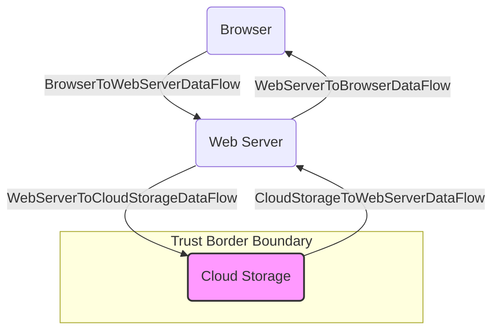

```mermaid
graph TD
    browser(Browser)
    web_server(Web Server)
    cloud_storage(Cloud Storage)

    browser -->|BrowserToWebServerDataFlow| web_server
    web_server -->|WebServerToBrowserDataFlow| browser
    web_server -->|WebServerToCloudStorageDataFlow| cloud_storage
    cloud_storage -->|CloudStorageToWebServerDataFlow| web_server

    classDef trustboundary fill:#f9f,stroke:#333,stroke-width:2px;
    class cloud_storage trustboundary;

    subgraph "Trust Border Boundary"
        cloud_storage
    end

```
